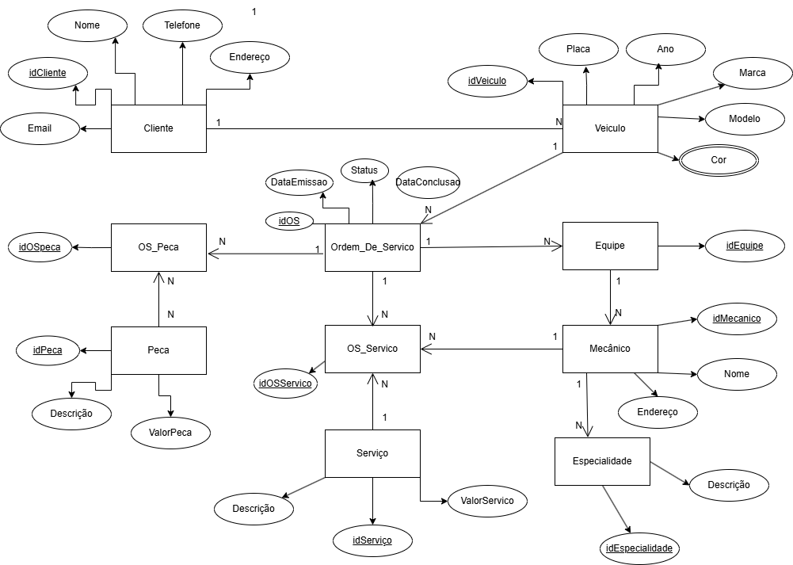

# 🛠️ Oficina Mecânica - Sistema de Gerenciamento de Ordens de Serviço

## 📌 Descrição do Projeto  
Este projeto apresenta o **Modelo Entidade-Relacionamento (MER)** para um **sistema de gerenciamento de ordens de serviço em uma oficina mecânica**.  
O sistema permite **o controle de clientes, veículos, ordens de serviço, equipes de mecânicos, serviços executados e peças utilizadas**, garantindo um gerenciamento eficiente e estruturado.

## 🎯 Objetivos do Sistema  
✅ Gerenciar o cadastro de **clientes e veículos**.  
✅ Controlar a execução de **ordens de serviço (OS)**.  
✅ Registrar **equipes de mecânicos** e serviços prestados.  
✅ Registrar as **peças utilizadas** em cada OS.  
✅ Calcular automaticamente os valores dos serviços e peças.  

## 🔗 Estrutura do Banco de Dados  
O banco de dados segue um **modelo relacional** estruturado para garantir organização e eficiência.

### **📌 Entidades e Relacionamentos**
1. **Cliente** → Pode ter **vários veículos**.  
2. **Veículo** → Pode ter **várias ordens de serviço** ao longo do tempo.  
3. **Ordem de Serviço** → É executada por uma **equipe de mecânicos** e pode conter vários **serviços e peças**.  
4. **Equipe** → Agrupa vários mecânicos responsáveis pelos serviços.  
5. **Mecânico** → Cada serviço executado é atribuído a um mecânico.  
6. **Serviço** → É registrado na OS e tem um custo de mão de obra.  
7. **Peça** → Pode ser usada em uma ou mais ordens de serviço.

🚀 Tecnologias Utilizadas
MySQL Workbench / Draw.io - Para criação do diagrama entidade-relacionamento (DER).
GitHub - Para versionamento e compartilhamento do projeto.

